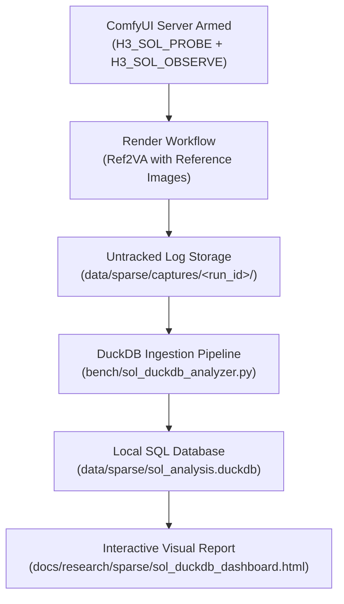

# End-to-End Guide: Sol-Attn Data Capture & Hyperparameter Optimization

A comprehensive guide for instrumenting, capturing, and analyzing **MiniMax H3 Sol-Attn** telemetry. This pipeline enables data-driven optimization of every hyperparameter in the [`MiniMaxH3Sol`](../../../sol_attn_h3.py) node—including `tau`, `quantizer`, `dense_blocks`, `sink_conditioning`, `token_routing`, and `start_percent`—using local, untracked DuckDB analytics and interactive visual dashboards.

---

## 1. Overview of the Capture Pipeline

MiniMax H3 uses a single **`PackedLayout`** sequence that combines text tokens, audio latents, video latents, and all reference images into one unified token stream. Evaluating block-sparse attention requires capturing real-world execution metrics without disrupting your production workflows.



### The Three Capture Instruments
1. **`H3_SOL_PROBE` (Counterfactual Quality)**: Runs Sol-Attn on each call, then immediately evaluates the dense fallback on the exact same $Q, K, V$ inputs. Records whole-call relative $L_2$, cosine similarity, per-head cosine distributions, and per-modality error (`text`, `video`, `audio`, `references`).
2. **`H3_SOL_OBSERVE` (Cost & Density)**: Extracts the kernel's exact block-dispatch routing buffer (`blk_cnt`), recording routed block density, forced sink counts, and peak CUDA VRAM high-water marks.
3. **`H3_CAPTURE` (Raw Tensor Slices)**: Dumps compact BF16 activation tensors (`qkv_*.pt`) post-RMSNorm/RoPE for offline parameter sweeps across thousands of configurations in seconds.

---

## 2. Setting Up the Node Parameters

Depending on your objective, configure the **MiniMax H3 Sol-Attn** node in ComfyUI for either a **Diagnostic Probe** (to discover bottlenecks) or a **Verification Probe** (to validate candidate production settings).

### Strategy A: Diagnostic Probe (Run First)
*Goal: Measure unmasked error across all 50 DiT blocks and all timesteps to discover which blocks need protection and what `tau` to select.*

> [!IMPORTANT]
> If a block is listed in `dense_blocks` or falls outside `start_percent`, Sol declines the call and runs the dense fallback. The probe logs this as a `skip` without measuring Sol error. Setting `dense_blocks=""` and `start_percent=0.0` is essential to expose the full model error profile.

| Parameter | Value | Rationale |
|---|---|---|
| **`dense_blocks`** | `""` *(empty string)* | Forces Sol across all blocks (0–49) so you can measure their counterfactual error. |
| **`start_percent`** | `0.0` | Forces Sol from step 0 to evaluate early-timestep sensitivity. |
| **`end_percent`** | `1.0` | Keeps Sol active through the end of denoising. |
| **`tau`** | `1.0` | Upstream baseline cutoff threshold. |
| **`quantizer`** | `rotated` | Current repository default with lowest INT8 quantization error. |
| **`sink_conditioning`** | `exact_kv_and_rows` | Exact KV attention for prompt & references; dense audio queries. |
| **`token_routing`** | `off` | Baseline run; compare against `measured` on run 2. |
| **`min_tokens`** | `12288` | Standard threshold to bypass short token refiners. |

### Strategy B: Verification Probe (Production Candidate)
*Goal: Validate that your chosen settings successfully protect sensitive blocks while maintaining optimal density savings.*

| Parameter | Value | Rationale |
|---|---|---|
| **`dense_blocks`** | `"45,48,49"` | Bypasses the 3 known lopsided-K tail blocks. |
| **`start_percent`** | `0.2` | Dense during the first 20% of steps (stabilizes global layout). |
| **`end_percent`** | `1.0` | Sparse during the remaining 80% (high-frequency detail). |
| **`tau`** | `1.0` | Target operational threshold. |
| **`quantizer`** | `rotated` | Standard Hadamard rotation quantizer. |
| **`sink_conditioning`** | `exact_kv_and_rows` | Full prompt & reference identity preservation. |
| **`token_routing`** | `measured blocks (0, 24, 32, 40)` | Rescues outlier tokens on verified layers. |
| **`min_tokens`** | `12288` | Standard threshold. |

---

## 3. Reference Conditioning Configuration

If your target workflow uses reference images (Ref2VA), **always attach your reference images during capture** (e.g. using `MiniMaxH3AppendRefImage` with size policy `max` and short edge `2048`):

1. **Token Length ($T$)**: Two 2048-edge reference images add thousands of visual tokens, expanding the sequence to **16,000–30,000+ tokens**. Capturing without them measures an unrepresentative text-to-video workload.
2. **Attention Sinks**: Reference tokens act as massive attention attractors for video queries. Pruning dynamics and row variances differ significantly when references are present.
3. **Modality Segmentation**: Attaching references allows DuckDB to isolate `reference` spans in `sol_probe_segments` to verify whether subject identity is preserved without degradation.

---

## 4. Arming and Launching the Server

Per project conventions, captures must be written to an untracked subfolder in `data/sparse/captures/`.

### Step 1: Check Current Server Liveness
Before stopping an existing server, verify whether it is currently serving or armed:
```bash
PID=$(ss -ltnp | grep ':8188' | grep -oP 'pid=\K[0-9]+' | head -1)
if [ -n "$PID" ]; then
    echo "Server running on PID $PID"
    tr '\0' '\n' < /proc/$PID/environ | grep '^H3_' || echo "Server is not armed"
fi
```

### Step 2: Launch ComfyUI Armed for Capture
Stop the old process and launch ComfyUI with the capture environment variables:
```bash
# Define your untracked run directory
RUN_DIR="data/sparse/captures/ref2va_diagnostic_01"
mkdir -p "$RUN_DIR"

# Kill existing listener if necessary
[ -n "$PID" ] && kill $PID && sleep 5

# Launch detached server from ComfyUI directory
export H3_SOL_PROBE="dir=$RUN_DIR"
export H3_SOL_OBSERVE="dir=$RUN_DIR"

nohup ./start.sh > "$RUN_DIR/comfy_server.log" 2>&1 &
```

Verify that the server is responding:
```bash
curl -s http://127.0.0.1:8188/system_stats | jq '.devices[0].name'
```

### Step 3: Run the Workflow
Execute your generation prompt via the ComfyUI web interface or API. The capture instruments automatically stream JSONL records into `$RUN_DIR/`:
- `sol_probe_<timestamp>.jsonl`
- `sol_observe_<timestamp>.jsonl`
- `blk_cnt_<timestamp>.u16`

---

## 5. Ingestion & Analysis with DuckDB

Once the render finishes, ingest the captured data into the untracked DuckDB database and generate the visual report:

```bash
# Ingest the run and build the dashboard
python bench/sol_duckdb_analyzer.py \
  --logs-dir data/sparse/captures/ref2va_diagnostic_01 \
  --db data/sparse/sol_analysis.duckdb \
  --out docs/research/sparse/sol_duckdb_dashboard.html
```

### Direct SQL Analytical Queries

You can execute queries against `data/sparse/sol_analysis.duckdb` directly from Python or the DuckDB CLI:

#### 1. Per-Block Error Ranking (Finding Candidate `dense_blocks`)
Identifies which DiT blocks exhibit excessive relative error under Sol:
```sql
SELECT 
    block,
    COUNT(*) AS steps_evaluated,
    ROUND(AVG(rel_l2) * 100, 2) AS avg_rel_l2_pct,
    ROUND(MAX(rel_l2) * 100, 2) AS max_rel_l2_pct,
    ROUND(MIN(cos), 4) AS min_cosine
FROM sol_probe_cells
GROUP BY block
ORDER BY avg_rel_l2_pct DESC
LIMIT 10;
```

#### 2. Attention Head Outlier Detection ("Hot Channels")
Pinpoints individual attention heads where channel collapse occurs:
```sql
SELECT 
    block,
    head_idx,
    ROUND(AVG(head_rel_l2) * 100, 2) AS head_l2_pct,
    ROUND(MIN(head_cos), 4) AS min_cosine
FROM sol_probe_heads
WHERE block IN (39, 45, 48, 49)
GROUP BY block, head_idx
ORDER BY min_cosine ASC
LIMIT 10;
```

#### 3. Modality Sensitivity Breakdown
Verifies that text prompts and reference images are not being corrupted:
```sql
SELECT 
    segment_kind,
    ROUND(AVG(seg_rel_l2) * 100, 2) AS avg_l2_error_pct,
    ROUND(MIN(seg_cos), 4) AS min_cosine,
    COUNT(*) AS cells_evaluated
FROM sol_probe_segments
GROUP BY segment_kind
ORDER BY avg_l2_error_pct DESC;
```

#### 4. Step Trajectory vs. Routed Density
Inspects the trade-off between routed block sparsity and peak VRAM across diffusion timesteps:
```sql
SELECT 
    step,
    ROUND(AVG(mean_routed_density) * 100, 2) AS routed_density_pct,
    ROUND(AVG(mean_kernel_density) * 100, 2) AS kernel_density_pct,
    ROUND(MAX(peak_vram_mb), 1) AS max_vram_mb
FROM sol_observe_calls
WHERE route = 'sol'
GROUP BY step
ORDER BY step;
```

---

## 6. Inspecting the Visual Dashboards

After ingestion, open the generated HTML files in any browser to review the visual findings:

- [`sol_duckdb_dashboard.html`](sol_duckdb_dashboard.html): Live database dashboard showing the 50-block bar chart, head-level outliers, and modality error tables.
- [`sol_tau_visual_explainer.html`](sol_tau_visual_explainer.html): Interactive visualizer demonstrating how adjusting `tau` modifies the block-sparse threshold and tile map.
- [`token_routing_comparison.html`](token_routing_comparison.html): Heatmap comparison showing how token routing rescues outlier tokens from unselected blocks.

---

## 7. Next-Step Parameter Calibration Rules

Once your capture data is in DuckDB, use these quantitative criteria to calibrate your production workflow:

1. **`dense_blocks`**: Add any block where `avg_rel_l2_pct > 12.0%` or `min_cosine < 0.93` (typically blocks 45, 48, 49).
2. **`start_percent`**: If early diffusion steps ($t \le 0.2$) show high relative error on text or video segments, maintain `start_percent=0.2` to keep early structural anchoring dense.
3. **`token_routing`**: If unnesting `sol_probe_heads` on middle blocks (e.g. 24, 32, 40) reveals high worst-head errors, enable `measured blocks (0, 24, 32, 40)`.
4. **`sink_conditioning`**: If `sol_probe_segments` shows text segment error above $5.0\%$, ensure `sink_conditioning="exact_kv_and_rows"` is active.
